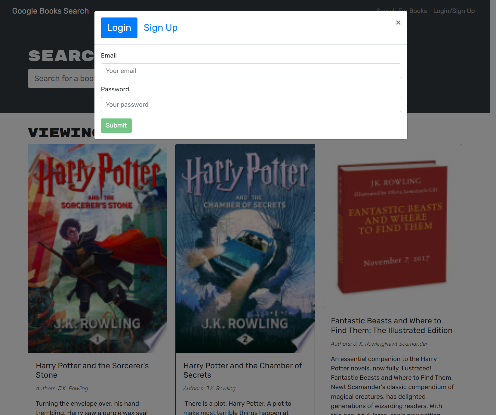
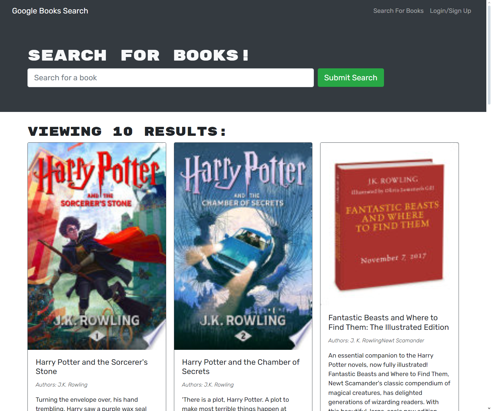
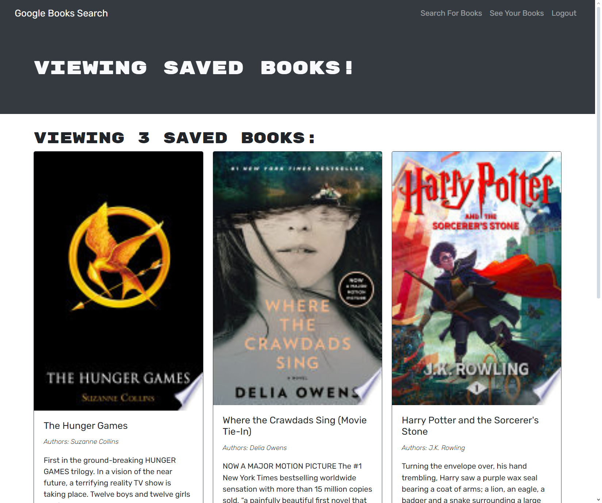

# Book Search Engine Starter Code

## Overview
The Book Search Engine is a web application that allows users to search for books, save their favorite books, and manage their reading list conveniently. It integrates with Google Books API to provide a vast collection of books for users to explore.

[book-search](https://book-search-c623.onrender.com)

## Table of Contents
- [Overview](#overview)
- [Getting Started](#getting-started)
- [Features](#features)
- [Contributing](#contributing)
- [License](#license)
- [Questions](#questions)

## Getting Started
- **Signup/Login:** Begin by creating a new account or logging in with existing credentials to access the full features of the Book Search Engine.
- **Search Books:** Use the search functionality to find books based on titles, authors, genres, or keywords. Explore a wide range of books available from Google Books API.
- **Saved Books:** Save your favorite books to a personalized reading list. Manage your saved books easily for quick access to your reading choices.

## Screenshots

## Features
1. **User Authentication:** Secure signup and login system for user accounts, ensuring personalized experiences and data management.
2. **Book Search:** Search books using various criteria such as title, author, genre, or keywords. Get detailed information about each book, including descriptions and cover images.
3. **Save Books:** Save books to your account for later reading. Organize your reading list and manage saved books effortlessly.
4. **Responsive Design:** The application is designed to be responsive, providing a seamless experience across devices, including desktops, tablets, and mobile phones.
5. **User Dashboard:** Access a user-friendly dashboard to view saved books, update account settings, and explore recommended reads based on your preferences.
6. **Data Persistence:** Utilize local storage to maintain saved books and user preferences, ensuring a consistent experience across sessions.
7. **Integration with Google Books API:** Access a vast library of books from Google Books API, offering a comprehensive collection for users to discover new titles and authors.
8. **Easy Navigation:** Navigate through the application intuitively with clear menu options, search bars, and interactive buttons for seamless interaction.

## Contributing
Thank you for considering contributing to our project! Follow these steps:

* Fork the repository and clone it to your local machine.
* Create a branch, make your changes, and commit them with a clear message.
* Push your changes to your forked repository.
* Open a pull request on the original repository.

Guidelines
* Follow existing code style and conventions.
* Ensure your code is well-documented.

Pull Requests
* Keep them focused and provide a clear description.
* Reference relevant issues if applicable.

## License

This project is not licensed and is provided as-is without any warranty. You are free to use, modify, and distribute the code as you see fit. However, we do not provide any legal protection or support for this project.

## Questions
For questions about this project, contact [Parker Rappleye](https://github.com/prappleman) via email at parker.rappleye1@gmail.com.
